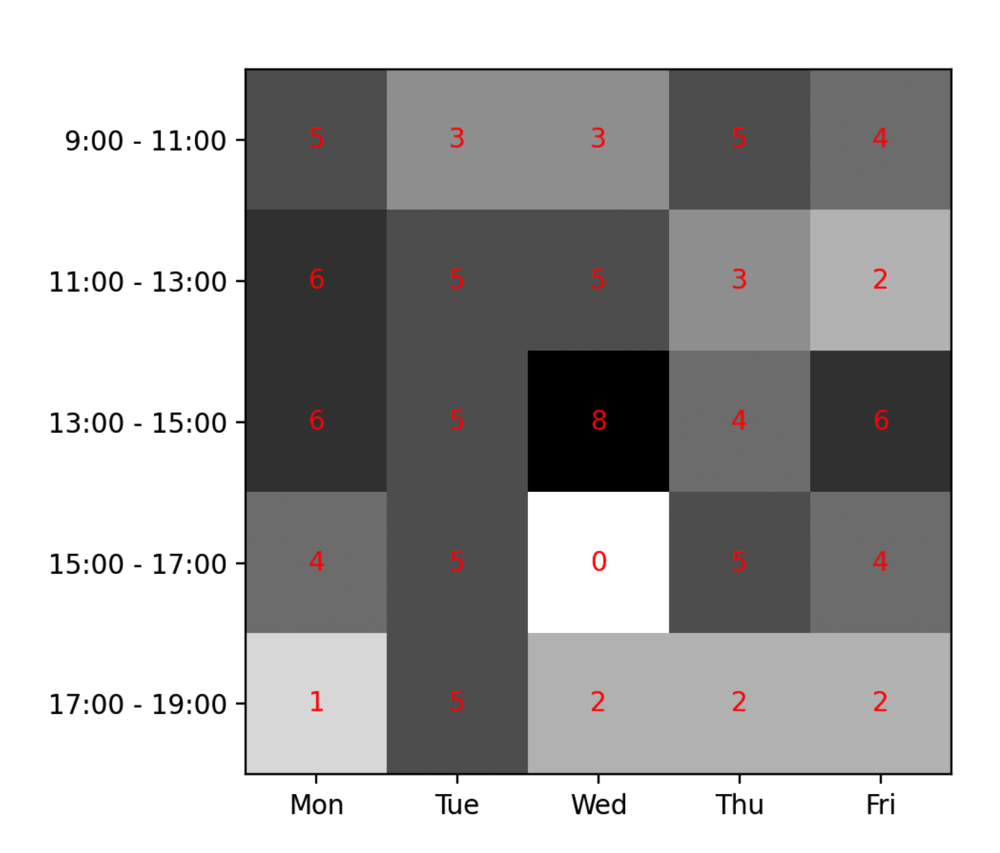
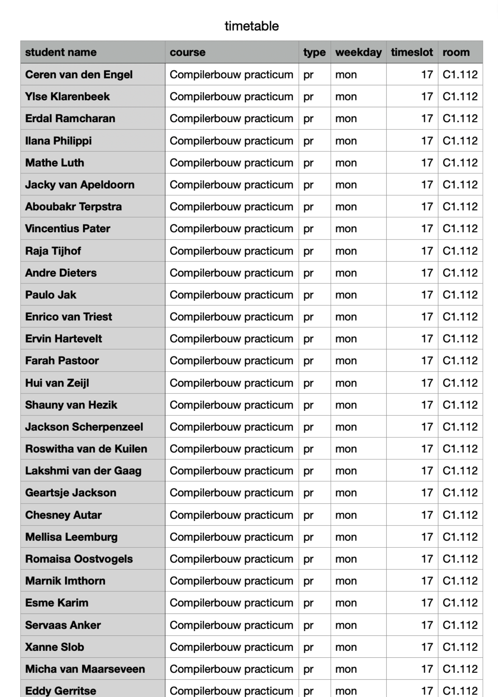

# 1. Representation

De onderstaande lijst toont de activiteiten die ik tijdens de **representation**
fase respectievelijk heb gedaan:

- opzetten van de codebase structuur
- eerste opzet in de main.py
- entities maken o.b.v. CSV files
- data inladen en omzetten naar entities
- gewenste output datastructuur bedenken
- functie maken die de input data transformeert naar de output data
- random timetable data genereren
- output plotten met heatmap (dat leek mij het makkelijkst en geeft ook nog een
  redelijk goeie visualisatie)

Hieronder een screenshot van de heatmap met random timetable data. Deze data
klopt totaal niet, maar het doel is (nog) niet om een oplossing hebben. Het doel
was hier om input om te zetten naar een gewenste output en dat visueel weer te
geven.

Ook heb ik de output al weggeschreven naar `out/timetable.csv`. Dit is hoe
de eerste versie eruit ziet (2432 regels, hier de eerste paar):

:bulb: Mogelijk zal ik in een latere versie CSV files maken waar in een
_personal timetable_ voor elke gebruiker wordt gegenereerd.
