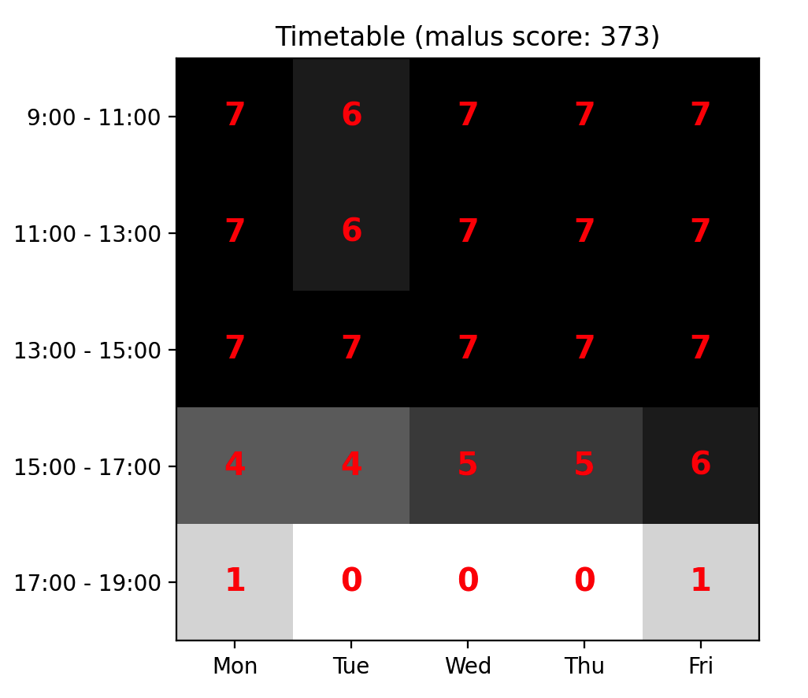
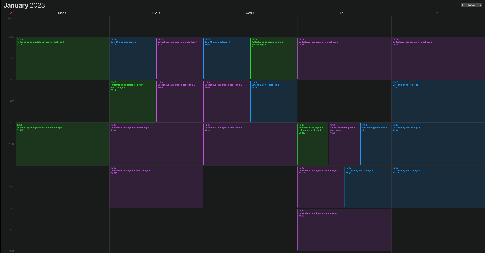
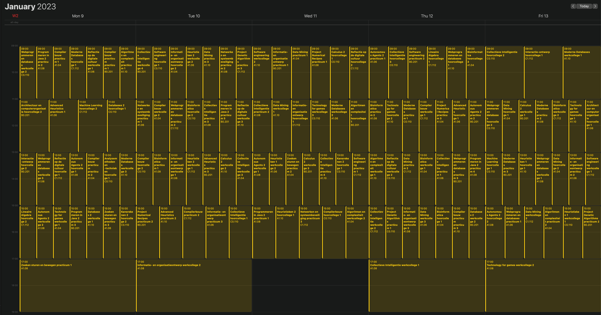

# 2. Baseline
Ik had al random timetable gegenereerd in de representation versie, maar in de
baseline versie ga ik dit omzetten naar een Randomizer class waarbij de data
gelinkt is met elkaar op basis van de opdracht.

De onderstaande lijst toont de activiteiten die ik tijdens de **baseline** fase
respectievelijk heb gedaan:
- randomizer class maken
- constraints bedenken
- datastructuur aangepast, want ik merkte dat het niet werkte op lange termijn
  (nieuwe structuur staat mij toe om code meer gescheiden te houden en om
  makkelijker constraints te checken)
- studenten toewijzen aan de course waar ze staan ingeschreven
- de werkcolleges en practica verdelen obv de capaciteit (probeer aantallen
  gelijk te maken, want dan is er nog ruimte om studenten over te plaatsen)
- De activiteiten inplannen in een zaal die groot genoeg is in capaciteit voor
  de activiteit
- Event swapping logica implementeren
- Tussensloten minimaliseren logica implementeren
- ICS export

Nadat ik het aantal studenten heb opgesplitst op basis van de werkcollege en
practicum capaciteit moest het 129 tijdsloten verdelen binnen 145 beschikbare
tijdsloten. Zonder groepen kon de randomizer elke keer een oplossing genereren
met minder dan 10 retries, nu kost het al 44 retries gemiddeld over 100
gegenereerde oplossingen.

Vervolgens heb ik ook nog de activiteiten ingepland in een zaal waar de
capaciteit groot genoeg is voor die activiteit. Nadat ik dit had geïmplementeerd
kwam de Randomizer soms in een oneindige loop terecht met nog een aantal
evenementen die het niet kon inplannen binnen een bepaalde aantal iteraties. Dit
liep op tot wel 100.000+ iteraties en nog steeds ging het fout. Dit komt omdat
bij het aanpassen van een violated activiteit worden de studenten niet
verwisseld naar mogelijk andere activiteiten indien mogelijk. Tenslotte hebben
werkcolleges en practicums de mogelijkheid om meerdere groepen te hebben o.b.v.
het aantal inschrijvingen en de capaciteit per werkgroep of practicum.

Ik had eerst studenten omgewisseld binnen de violated activiteiten, maar dit gaf
geen oplossing, want misschien heeft 1 vak 3 groepen aan werkcolleges, maar als
er maar 1 groep gemarkeerd wordt als violated, dan verwissel ik het alleen met
zichzelf. Ik moet dus de studenten wisselen binnen alle drie de werkcolleges (en
ook voor practicums). Dit gaf al een aanzienlijk beter resultaat.

Vervolgens heb ik geprobeerd om elke violation (activiteit) om te wisselen met
een random ander activiteit dat geen violation is. Dit werkte verbazingwekkend
goed. Heel af en toe raakte het in een infinite loop, dus ik heb een extra check
toegevoegd dat de randomizer stopt na 2000 retries.

Uiteindelijk heb ik nog rekening gehouden met tussensloten. Als er 1 of 2
tussensloten zitten tussen twee vakken, dan geeft dit puur maluspunten. Als er 3
(of meer) tussensloten zitten tussen twee vakken, dan worden beide vakken
gemarkeerd als violations.  Dit is hetgeen dat het aantal acties doet vergroten
waardoor ik mijn logica wat moest aanpassen om überhaupt nog mogelijke
oplossingen te kunnen genereren.

Helaas was de combinatie van activiteiten aanpassen + activiteiten omwisselen +
studenten wisselen niet optimaal. Toen bedacht ik mij dat ik bepaalde dingen
alleen kan laten uitvoeren met een bepaalde kans. Ik kwam er al snel achter dat
het wisselen van activiteiten het aantal violations soms zelfs hoger had
gemaakt, maar het wisselen van studenten haalde het weer aanzienlijk naar
beneden.

Ik heb veel opties geprobeerd door het percentage aan te passen, door kansen
*in* kansen te berekenen en zo geprobeerd te achterhalen wat positieve of
negatieve invloed had op het aantal violations. Uiteindelijk bleek de 10% kans
studenten verwisselen binnen de 10% kans van het omwisselen van activiteiten
zeer goed te werken. Ik zag ook in de logs dat het aantal violations ook sterk
naar beneden bleef gaan op deze manier en dat was een zeer interessante
ontdekking.

Na veel combinaties te hebben getest, ben ik er achter gekomen dat het volgende
erg goed werkt:
- elke violated activiteiten *altijd* aanpassen
- 10% kans dat activiteiten worden omgewisseld
    - 10% kans dat studenten verwisseld worden (binnen de kans van het omwisselen van activiteiten)

Binnen 1000 iteraties met bovenstaande logica zijn dit de uiteindelijke resultaten:
- Min. retries: 90
- Max. retries: 5000
- Avg. retries: 2489
- Min. malus score: 30
- Max. malus score: 106
- Avg malus score: 60
- Solutions: 828/1000

Ik moest wel het aantal retries toegestaan verhogen naar 5000, maar hierdoor kan
er bijna altijd een oplossing worden gegenereerd.

NOTE: Op dit moment bereken ik alleen de malus score op basis van de opdracht,
maar ik doe er nog niks mee. Ik kan dit later gebruiken om n-aantal oplossingen
te genereren en dan diegene pakken met de laagste malus score.

Hieronder nog een screenshot van een oplossing in de baseline versie. In de
afbeelding is te zien dat tijdsloten meer naar boven worden gehaald en dat er
maximaal 1 activiteit plaats vindt in het laatste tijdslot van 17:00 - 19:00.

Uiteindelijk heb ik geïmplementeerd dat ik de timetable naar `ics` bestanden kan
exporteren. Er wordt een `ics` bestand met alle activiteiten weggeschreven en
ook nog per vak een `ics` (voor debugging erg handig!)

Hieronder heb ik wat screenshots van hoe de `ics` bestanden er in Apple Calendar
uitzien.

Hier heb ik 3 `ics` bestanden van 3 verschillende vakken geïmporteerd.

en hieronder nog een screenshot van alle 29 vakken en hun planningen samen,
gewoon omdat het kan.

