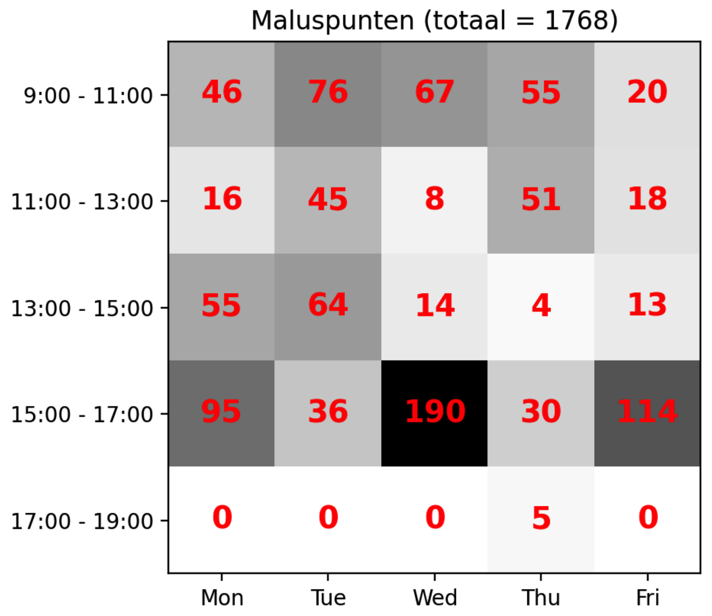
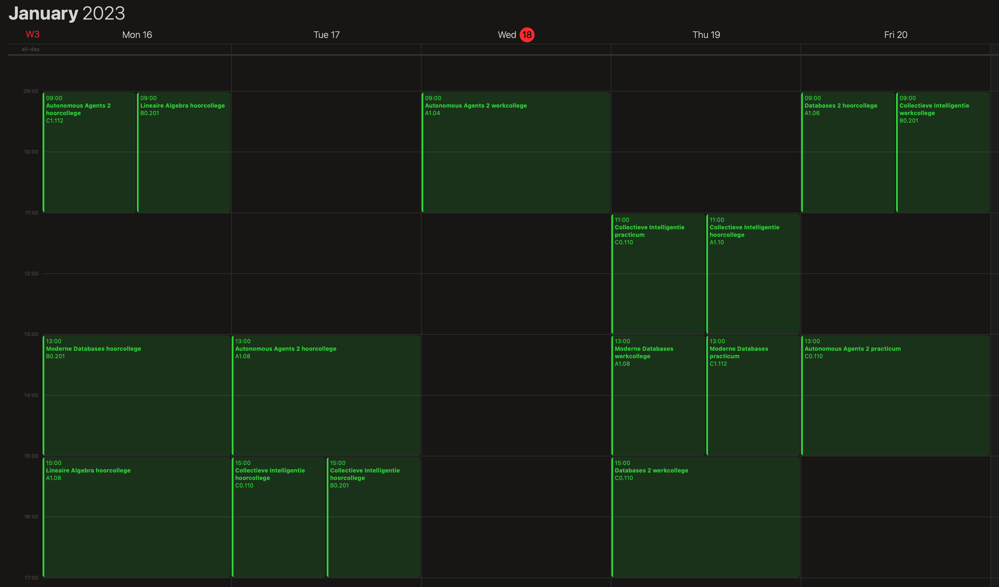

# 2. Baseline
Ik had al random timetable gegenereerd in de representation versie, maar in de
baseline versie ga ik dit omzetten naar een Randomizer class waarbij de data
gelinkt is met elkaar op basis van de opdracht.

De onderstaande lijst toont de activiteiten die ik tijdens de **baseline** fase
respectievelijk heb gedaan:
- Randomizer class maken
- constraints bedenken
- datastructuur aangepast, want ik merkte dat het niet werkte op lange termijn
  (nieuwe structuur staat mij toe om code meer gescheiden te houden en om
  makkelijker constraints te checken)
- studenten toewijzen aan de course waar ze staan ingeschreven
- de werkcolleges en practica verdelen obv de capaciteit (probeer aantallen
  gelijk te maken, want dan is er nog ruimte om studenten over te plaatsen)
- De activiteiten inplannen in een zaal die groot genoeg is in capaciteit voor
  de activiteit
- Logica implementeren voor het omwisselen van activiteiten
- Tussensloten minimaliseren logica implementeren
- ICS export
- random walk met data plots

Nadat ik het aantal studenten heb opgesplitst op basis van de werkcollege en
practicum capaciteit moest het 129 tijdsloten verdelen binnen 145 beschikbare
tijdsloten. Zonder groepen kon de Randomizer elke keer een oplossing genereren
met minder dan 10 retries, nu kost het al 44 retries gemiddeld over 100
gegenereerde oplossingen.

Vervolgens heb ik ook nog de activiteiten ingepland in een zaal waar de
capaciteit groot genoeg is voor die activiteit. Nadat ik dit had geïmplementeerd
kwam de Randomizer soms in een infinite loop terecht met nog een aantal
activiteiten die het niet kon inplannen binnen een bepaalde aantal iteraties.
Dit liep op tot wel 100.000+ iteraties en nog steeds ging het door. Dit komt
omdat bij het aanpassen van een violated activiteit worden de studenten niet
verwisseld naar andere activiteiten indien mogelijk. Tenslotte hebben
werkcolleges en practicums de mogelijkheid om meerdere groepen te hebben o.b.v.
het aantal inschrijvingen en de capaciteit per werkgroep of practicum.

Ik had eerst studenten verwisseld binnen de violated activiteiten, maar dit gaf
geen oplossing, want misschien heeft 1 vak 3 groepen aan werkcolleges, maar als
er maar 1 groep gemarkeerd wordt als violated, dan verwissel ik het alleen met
zichzelf. Ik moet dus de studenten wisselen binnen alle drie de werkcolleges (en
ook voor practicums). Dit gaf al een aanzienlijk beter resultaat.

Vervolgens heb ik geprobeerd om elke violation (activiteit) om te wisselen met
een random ander activiteit dat geen violation is. Dit werkte verbazingwekkend
goed. Heel af en toe raakte het in een infinite loop, dus ik heb een extra check
toegevoegd dat de Randomizer stopt na n-aantal retries en dan wordt dit
gemarkeerd als *geen oplossing*.

Uiteindelijk heb ik nog rekening gehouden met tussensloten. Als er 1 of 2
tussensloten zitten tussen twee activiteiten per student, dan geeft dit puur en
alleen maluspunten. Als er 3 (of meer) tussensloten zitten tussen twee
activiteiten, dan wordt de laatste gemarkeerd als violation, want de enige
situatie waarin er 3 tijdsloten zijn is als het tijdslot vóór de tussensloten
9:00 is en het tijdslot ná de tussensloten 17:00 is. Omdat we toch 5 malus
punten krijgen voor het boeken in het 17:00 tijdslot markeren we alleen deze als
een violation.  Dit is hetgeen dat het aantal acties doet vergroten waardoor ik
mijn logica wat moest aanpassen om überhaupt nog mogelijke oplossingen te kunnen
genereren.

Helaas was de combinatie van activiteiten verplaatsen, twee random activiteiten
omwisselen en studenten wisselen niet voldoende om tot een oplossing te komen.
Sterker nog, deze combinatie kan geen oplossing genereren omdat het aantal
violations altijd rondom een bepaalde waarde bleef zweven maar nooit precies 0
wordt. Toen bedacht ik mij dat ik bepaalde dingen alleen kan laten uitvoeren met
een bepaalde kans. Ik kwam er al snel achter dat het wisselen van twee
activiteiten het aantal violations soms zelfs hoger had gemaakt, maar het
wisselen van studenten haalde het weer aanzienlijk naar beneden.

Ik heb veel opties geprobeerd door het percentage aan te passen en zo geprobeerd
te achterhalen wat positieve of negatieve invloed heeft op het aantal
violations.

Na veel combinaties zelfstandig te hebben getest ben ik er achter gekomen dat
het volgende erg goed werkt:

- elke violated activiteit verplaatsen naar een ander tijdslot dan de huidige
  (waarbij de andere activiteit *niet* violated is)
- 10% kans dat de elke violation met een andere activiteit (dat geen violation
  is) wordt omgewisseld
- 1% kans dat studenten verwisseld worden

Hierdoor wordt er altijd een oplossing gegenereerd en zal het algortime nooit
oneindig door gaan.

Uiteindelijk bleek de 1% kans studenten verwisselen met een 10% kans voor het
omwisselen van activiteiten zeer goed te werken om het aantal retries te
minimaliseren, met name de 1% kans voor het verwisselen van studenten had erg
veel invloed. De 1% kans klinkt alsof het weinig uitmaakt, maar elke andere
waarde met of zonder aanpassing van andere percentages maakt het alleen maar
slechter n.a.v. mijn eigen (gelimiteerde) experimenten. De 1% kans maakt écht
een verschil hier. Het reduceert het aantal retries met honderdtallen.

Binnen 1000 iteraties met bovenstaande logica zijn dit de uiteindelijke
resultaten:

- Min. retries: 37
- Max. retries: 975
- Avg. retries: 220
- Min. malus score: 173
- Max. malus score: 2697
- Avg malus score: 331
- Solutions: 1000/1000

## ICS Export

Hieronder nog een screenshot van een oplossing in de baseline versie. In de
afbeelding is te zien dat tijdsloten meer naar boven worden gehaald en dat er
maximaal 1 activiteit plaats vindt in het laatste tijdslot van 17:00 - 19:00.

Uiteindelijk heb ik geïmplementeerd dat ik de timetable naar `ics` bestanden kan
exporteren. Er worden drie verschillende categorieën geëxporteerd:
- `out/ics/timetable.csv` bevat de hele timetable voor een hele week
- `out/ics/courses/` bevat een timetable export voor elk vak
- `out/ics/students/` bevat een timetable export voor elke student

Hieronder heb ik wat screenshots van hoe de `ics` bestanden er in Apple Calendar
uitzien.

Het rooster van één van de studenten:

Het rooster van één van de vakken:

Hieronder nog een screenshot van alle 29 vakken en hun roosters samen, gewoon
omdat het kan.

## Random walk

Vervolgens heb ik een *random walk* geïmplementeerd die 1 oplossing genereert en
vervolgens n-aantal keer de volgende data verzamelt:
- twee random ingeplande met elkaar activiteiten omwisselen
- studenten in een groep verwisselen
- twee random activiteiten omwisselen én studenten verwisselen

Hier heb ik niet gekeken naar het aantal retries, maar naar het aantal
maluspunten om te zien hoe het aantal maluspunten wordt beïnvloed door deze
aanpassingen.

Zoals in de onderstaande grafieken te zien is heeft het wisselen van studenten
(students permuting) redelijk slechte invloed op de malus score. Het omwisselen
van twee random activiteiten (event swapping) heeft daarentegen een positieve
invloed in het begin, maar na ±500 iteraties heeft het niet zo heel veel nut
meer en zweeft het om een bepaalde malus score heen en weer.

