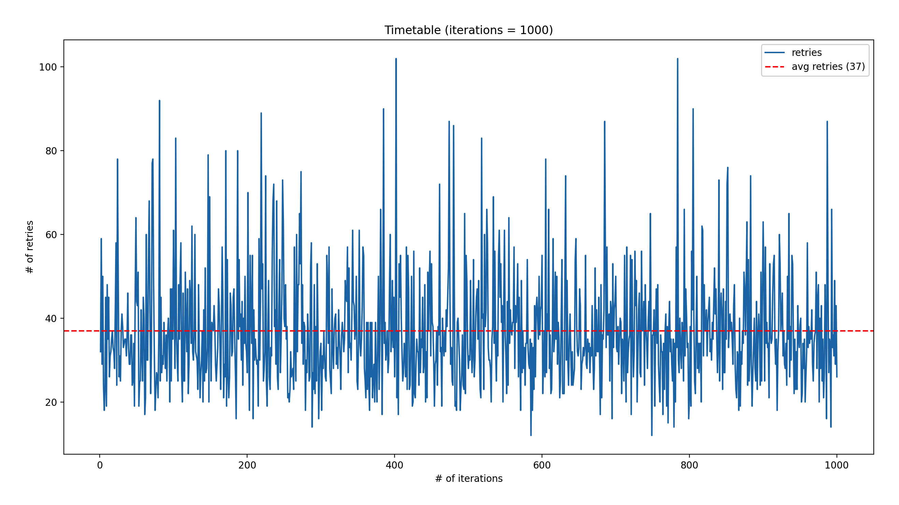
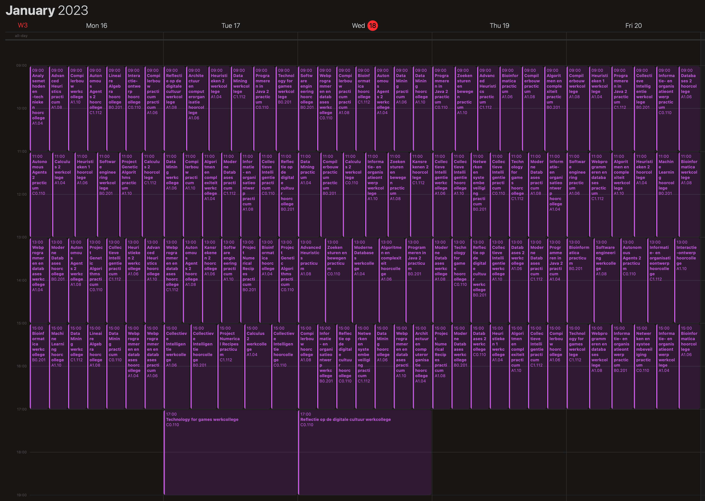

# 2. Baseline
Ik had al random timetable gegenereerd in de representation versie, maar in de
baseline versie ga ik dit omzetten naar een Randomizer class waarbij de data
gelinkt is met elkaar op basis van de opdracht.

De onderstaande lijst toont de activiteiten die ik tijdens de **baseline** fase
respectievelijk heb gedaan:
- Randomizer class maken
- constraints bedenken
- datastructuur aangepast, want ik merkte dat het niet werkte op lange termijn
  (nieuwe structuur staat mij toe om code meer gescheiden te houden en om
  makkelijker constraints te checken)
- studenten toewijzen aan de course waar ze staan ingeschreven
- de werkcolleges en practica verdelen obv de capaciteit (probeer aantallen
  gelijk te maken, want dan is er nog ruimte om studenten over te plaatsen)
- De activiteiten inplannen in een zaal die groot genoeg is in capaciteit voor
  de activiteit
- Tussensloten minimaliseren logica implementeren
- ICS export
- random walk met data plots

Nadat ik het aantal studenten heb opgesplitst op basis van de werkcollege en
practicum capaciteit moest het 129 tijdsloten verdelen binnen 145 beschikbare
tijdsloten. Zonder groepen kon de Randomizer elke keer een oplossing genereren
met minder dan 10 retries, nu kost het al 44 retries gemiddeld over 100
gegenereerde oplossingen.

Vervolgens heb ik ook nog de activiteiten ingepland in een zaal waar de
capaciteit groot genoeg is voor die activiteit.

Uiteindelijk heb ik nog rekening gehouden met tussensloten. Als er 1 of 2
tussensloten zitten tussen twee activiteiten per student, dan geeft dit puur en
alleen maluspunten. Als er 3 (of meer) tussensloten zitten tussen twee
activiteiten, dan wordt de laatste gemarkeerd als violation, want de enige
situatie waarin er 3 tijdsloten zijn is als het tijdslot vóór de tussensloten
9:00 is en het tijdslot ná de tussensloten 17:00 is. Omdat we toch 5 malus
punten krijgen voor het boeken in het 17:00 tijdslot markeren we alleen deze als
een violation.

Binnen 1000 iteraties met bovenstaande logica zijn dit de uiteindelijke
resultaten:
- Min. retries: 14
- Max. retries: 120
- Avg. retries: 36
- Min. malus score: 836
- Max. malus score: 1575
- Avg malus score: 1160
- Solutions: 1000/1000

Hieronder nog een screenshot van een oplossing in de baseline versie. In de
afbeelding is te zien dat tijdsloten meer naar boven worden gehaald en dat er
maximaal 1 activiteit plaats vindt in het laatste tijdslot van 17:00 - 19:00.

## ICS Export

Uiteindelijk heb ik geïmplementeerd dat ik de timetable naar `ics` bestanden kan
exporteren. Er worden drie verschillende categorieën geëxporteerd:
- `out/ics/timetable.csv` bevat de hele timetable voor een hele week
- `out/ics/courses/` bevat een timetable export voor elk vak
- `out/ics/students/` bevat een timetable export voor elke student

Hieronder heb ik wat screenshots van hoe de `ics` bestanden er in Apple Calendar
uitzien.

Het rooster van één van de studenten:

Het rooster van één van de vakken:

Hieronder nog een screenshot van alle 29 vakken en hun roosters samen, gewoon
omdat het kan.

## Random walk

Vervolgens heb ik een *random walk* geïmplementeerd die 1 oplossing genereert en
vervolgens n-aantal keer de volgende data verzamelt:
- wissel twee random ingeplande activiteiten met elkaar om
- studenten verwisselen
- twee random activiteiten omwisselen én studenten verwisselen

Hier heb ik niet gekeken naar het aantal retries, maar naar het aantal
maluspunten om te zien hoe het aantal maluspunten wordt beïnvloed door deze
aanpassingen.

Zoals in de onderstaande grafieken te zien is heeft het wisselen van studenten
(students permuting) redelijk slechte invloed op de malus score. Het gaat even
flink naar beneden, wat positief is, maar daar blijft het bij. Waarschijnlijk
was de gegenereerde oplossing erg slecht verdeeld qua studenten, waardoor een
permutatie dit flink naar beneden heeft gehaald.

Het omwisselen van twee random activiteiten (event swapping) geeft meer speling
in de malus score waarbij het varieert van 900+ tot wel 1400+.

---

:point_right: [Klik hier om naar de volgende fase te gaan](../3-greedy-algorithm/README.md)
