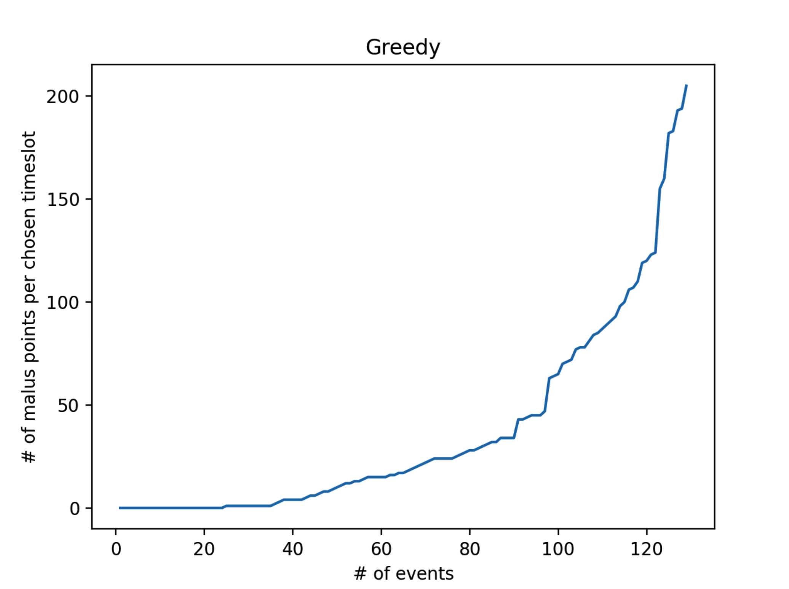

# 3. Greedy algorithms

Na een implementatie te hebben afgerond voor een random algoritme, is het nu
tijd om een greedy implementatie te doen. Ik heb er voor gekozen om een
constructief greedy algoritme te implementeren, omdat het hier bij een
lesrooster handiger is om alle mogelijke opties af te gaan en dan te zien welke
de minste maluspunten heeft.

De pseudo code voor mijn constructieve algoritme is als volgt:
-  haal alle activiteiten op die ingepland moeten worden van alle vakken
   (aflopend gesorteerd op het aantal activiteiten dat ingepland moet worden per
   vak)
-  zolang er activiteiten zijn die ingeplant moeten worden:
    - pak de eerste activiteit
    - vind het beste tijdslot (oplopend gesorteerd op aantal violations + maluspunten + tijdslot + dag vd week)
    - plaats de activiteit in de eerste de beste oplossing

Ook bedacht ik mij dat het logischer zou zijn om van links naar rechts in te
plannen, in plaats van boven naar onder, zodat eerst de tijdsloten van 9 uur
ingevuld worden voor elke dag, dan 11 uur, dan 15 uur etc. Dit gaf ook een iets
betere malus score en dit zorgt er ook voor dat het aantal ingeplande 17:00 -
19:00 tijdsloten minder wordt.

Het greedy algoritme berekent de beste optie voor een activiteit door de deze in
elk tijdslot in te plannen in de zaal die perfect of groot genoeg is qua
capaciteit. Vervolgens wordt een malus score voor deze situatie berekend en in
een lijst gestopt. Uiteindelijk is elk tijdslot en zaal gecheckt en dan sorteren
we al deze mogelijkheden op het laagste aantal violations met laagste aantal
maluspunten en vervolgens nog op vroegste tijdslot en day van de week. Dit geeft
ons het beste eerst opkomende tijdslot met de minste maluspunten.

Hieronder is een versie te zien zonder violations met 120 maluspunten. Dit toont
aan dat het greedy algoritme het aantal maluspunten flink verminderd ten
opzichte van het random algortime dat 1200+ maluspunten opleverde.

Hieronder nog een grafiek van hoe greedy alle 129 activiteiten inplant in een
heel rooster en hoe de maluspunten lopen.

# Random Greedy

Na het implementeren van een greedy algoritme heb ik ook een *random  greedy*
geïmplementeerd. Een activiteit wordt nu random gekozen uit de lijst van
mogelijke activiteiten die nog niet ingeroosterd zijn, in plaats van altijd de
activiteit te nemen die de meeste activiteiten in moet plannen. Ook wordt van
alle mogelijke tijdslot opties voor een activiteit nu een willekeurig tijdslot
gekozen. Dit was erg veel spelen met de random waardes, maar tot nu toe krijg ik
*niet* iets beters dan het greedy algortime zelf.

Hieronder een kort overzicht met wat ik deels geprobeerd heb met 10 iteraties
per test:
- 100% greedy met 100% random (avg malus score: 683)
- 100% greedy met 50% random (avg malus score: 381)
- 100% greedy met 10% random (avg malus score: 223)
- 100% greedy met 1% random (avg malus score: 131)

Het lijkt erop dat hoe meer random erbij komt, hoe slechter de score wordt. Op
zich logisch, omdat het greedy algoritme over het algemeen de beste keuze pakt.
