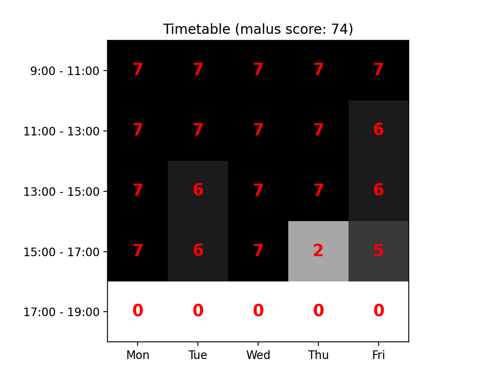
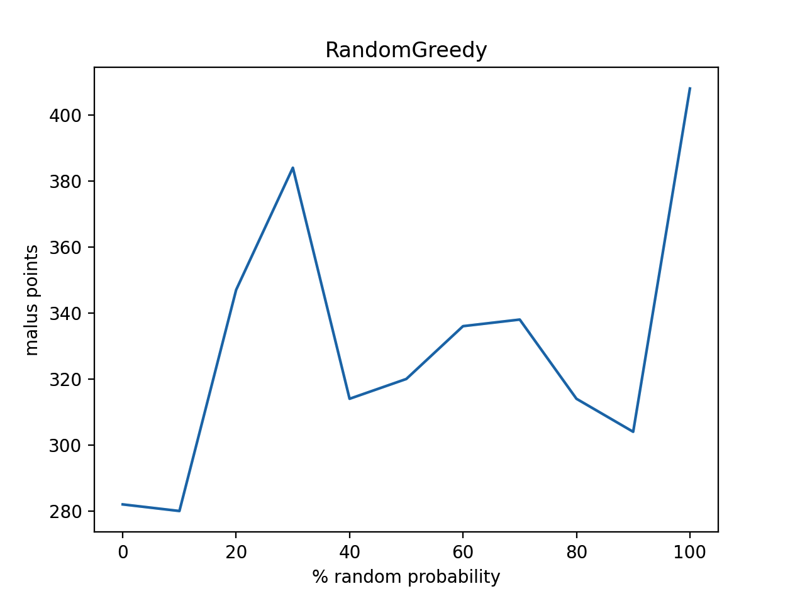

# 3. Greedy algorithms

Na een implementatie te hebben afgerond voor een random algoritme, is het nu
tijd om een greedy implementatie te doen. Ik heb er voor gekozen om een
constructief greedy algoritme te implementeren, omdat voor mijn gevoel dit voor
de meest hand liggende keuze is.

De pseudo code voor mijn constructieve algoritme is als volgt:
-  haal alle activiteiten op die ingepland moeten worden van alle vakken
   (aflopend gesorteerd op het aantal activiteiten dat ingepland moet worden per
   vak)
-  zolang er activiteiten zijn die ingeplant moeten worden:
    - pak de eerste activiteit
    - vind het beste tijdslot (gesorteerd op aantal violations + maluspunten + dag vd week + tijdslot)
    - plaats de activiteit in de eerste de beste oplossing

Ook bedacht ik mij dat het logischer zou zijn om van links naar rechts in te
plannen, in plaats van boven naar onder, zodat eerst de tijdsloten van 9 uur
ingevuld worden voor elke dag, dan 11 uur, dan 15 uur etc, maar helaas gaf dit
een veel slechter resultaat.

Het greedy algoritme berekent de beste optie voor een activiteit door de deze in
elk tijdslot in te plannen in de zaal die perfect of groot genoeg is qua
capaciteit. Vervolgens wordt een malus score voor deze situatie berekend en in
een lijst gestopt. Uiteindelijk is elk tijdslot en zaal gecheckt en dan sorteren
we al deze mogelijkheden op het laagste aantal violations met laagste aantal
maluspunten en vervolgens nog op vroegste tijdslot en dag van de week. Dit geeft
ons het beste eerst opkomende tijdslot met de minste maluspunten.

Hieronder is een versie te zien zonder violations met 286 maluspunten. Dit toont
aan dat het greedy algoritme het aantal maluspunten flink verminderd ten
opzichte van het random algortime dat 1000+ maluspunten opleverde.

# Random Greedy

Na het implementeren van een greedy algoritme heb ik ook een *random greedy*
geïmplementeerd. Ik heb geprobeerd om met bepaalde kansen soms random en soms
greedy uit te voeren. Hieronder een overzicht van een deel wat ik getest heb:

Uit de bovenstaande grafiek kan geconcludeerd worden dat hoe hoger het aantal
random acties is, hoe hoger het aantal maluspunten. Dit is niet wat we willen en
daarom is het random greedy algoritme geen optie om te gebruiken binnen deze
casus.

---

:point_right: [Klik hier om naar de volgende fase te gaan](../4-hillclimber/README.md)
