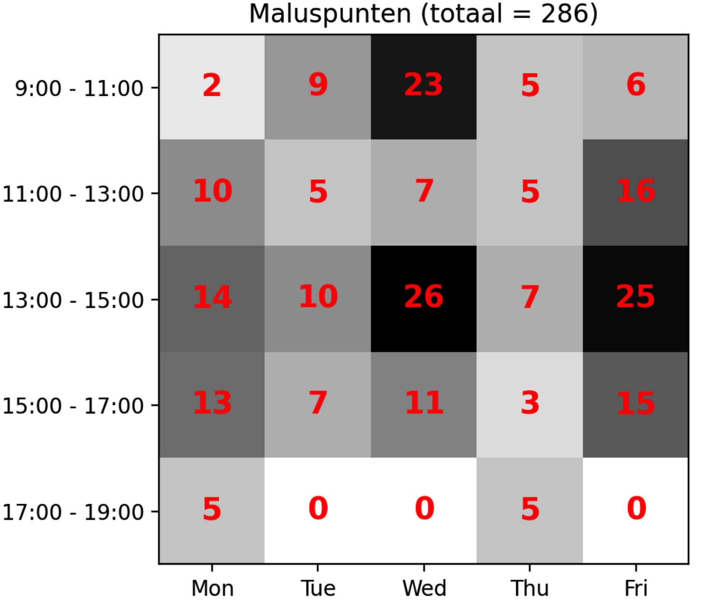

# 3. Greedy algorithms

Na een implementatie te hebben afgerond voor een random algoritme, is het nu
tijd om een greedy implementatie te doen. Ik heb er voor gekozen om een
constructief greedy algoritme te implementeren, omdat voor mijn gevoel dit voor
de meest hand liggende keuze is.

De pseudo code voor mijn constructieve algoritme is als volgt:
-  haal alle activiteiten op die ingepland moeten worden van alle vakken
   (aflopend gesorteerd op het aantal activiteiten dat ingepland moet worden per
   vak)
-  zolang er activiteiten zijn die ingeplant moeten worden:
    - pak de eerste activiteit
    - vind het beste tijdslot (gesorteerd op aantal violations + maluspunten + dag vd week + tijdslot)
    - plaats de activiteit in de eerste de beste oplossing

Ook bedacht ik mij dat het logischer zou zijn om van links naar rechts in te
plannen, in plaats van boven naar onder, zodat eerst de tijdsloten van 9 uur
ingevuld worden voor elke dag, dan 11 uur, dan 15 uur etc, maar helaas gaf dit
een veel slechter resultaat. Van boven naar onder geeft een malus score van 74
en van links naar rechts geeft een malus score van 205.

Het greedy algoritme berekent de beste optie voor een activiteit door de deze in
elk tijdslot in te plannen in de zaal die perfect of groot genoeg is qua
capaciteit. Vervolgens wordt een malus score voor deze situatie berekend en in
een lijst gestopt. Uiteindelijk is elk tijdslot en zaal gecheckt en dan sorteren
we al deze mogelijkheden op het laagste aantal violations met laagste aantal
maluspunten en vervolgens nog op vroegste tijdslot en day van de week. Dit geeft
ons het beste eerst opkomende tijdslot met de minste maluspunten.

Hieronder is een versie te zien zonder violations met 74 maluspunten. Dit toont
aan dat het greedy algoritme het aantal maluspunten flink verminderd ten
opzichte van het random algortime dat 1200+ maluspunten opleverde.

Hieronder een grafiek van hoe greedy alle 129 activiteiten inplant in een heel
rooster. De y-as toont het minst aantal maluspunten dat op dat moment gekozen
kon worden voor het zoveelste event op de x-as.

# Random Greedy

Na het implementeren van een greedy algoritme heb ik ook een *random greedy*
geïmplementeerd. Toen ik keek naar de grafiek van het greedy algoritme, toen
viel het mij op dat voor de eerste ±22 events de malus score 0 is. Ik bedacht
mij direct dat ik dit kan gebruiken in het random greedy algoritme, want als we
meerdere opties hebben die allemaal 0 zijn in malus score dan kunnen we een
random optie hiervan pakken. Helaas geeft dit nooit een betere optie dan het
greedy algoritme zelf. Met deze logica was het minimale altijd maluspunten
altijd boven de 100.

Vervolgens heb ik geprobeerd om met bepaalde kansen soms random en soms greedy
uit te voeren. Hieronder een overzicht van een deel wat ik getest heb:

| greedy % kans | random % kans | malus score |
| ------------- | ------------- | ----------- |
| 0             | 100           | 600+        |
| 50            | 50            | 300+        |
| 90            | 10            | 100+        |
| 98            | 2             | 100+        |

Helaas zijn al deze opties slechter dan het greedy algoritme met 74 maluspunten.
Het lijkt erop dat mijn greedy implementatie erg sterk is in het genereren van
de best mogelijke oplossing.

---

:point_right: [Klik hier om naar de volgende fase te gaan](../4-hillclimber/README.md)
