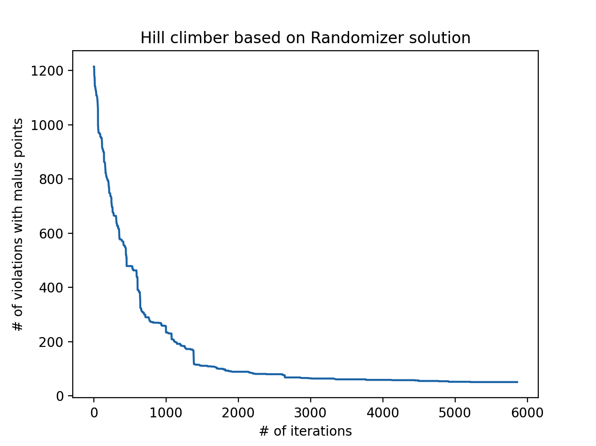
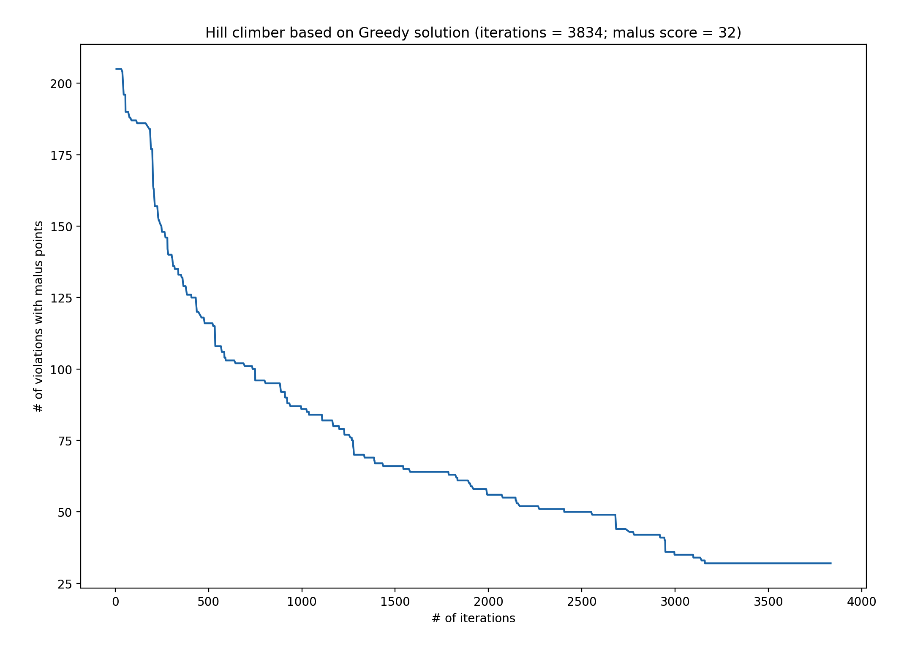
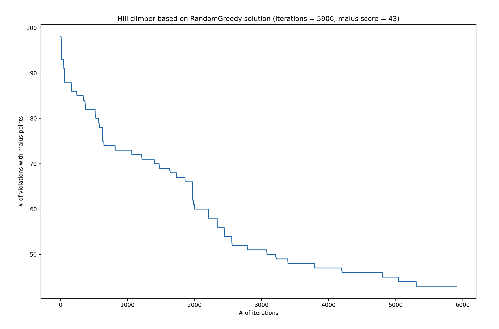

# 4. Hill climber

In deze fase heb ik een hill climber geïmplementeerd die alleen maar even goede
of betere oplossingen accepteert. Dit algoritme gaat door tot dat het aantal
opgegeven iteraties bereikt is, of als er na 500 iteraties geen strict betere
oplossing is gevonden.

:exclamation: Het moet hier *strict* beter zijn omdat het anders in een
oneindige loop terecht komt waarbij het even goede states kan krijgen, maar
nooit een betere.

In de baseline fase heb ik een random walk gemaakt die aantoont hoe de malus
score wordt beïnvloedt door het omwisselen van twee random activiteiten of door
het verwisselen van studenten binnen een vak.

Hieronder nog een keer de grafiek van de random walk als opfrisser:

Zoals te zien is heeft het verwisselen wel wat effect, maar niet veel na een
bepaald aantal iteraties. Het omwisselen van twee activiteiten geeft meer
speling in de grafiek, wat dus betekent dat dit veel invloed heeft. Ik heb dus
bedacht om in de hill climber het volgende te doen:

- 40% kans om een activiteit naar een random ander tijdslot te doen (in mogelijk een andere zaal)
- 40% kans om twee activiteiten om te wisselen
- 20% kans om studenten te verwisselen

Bij hill climber beginnen we met "een oplossing". Ik heb de hill climber getest
op een oplossing van de randomizer, greedy en random greedy om zo het effect te
kunnen zien voor een oplossing met een hele hoge malus score (randomizer) of een
oplossing die al redelijk laag begint zoal de greedy of random greedy.

Hieronder is te zien hoe de hill climber te werk gaat voor alle algoritmen. Naar
mate het aantal iteraties toe neemt, wordt de som van violations en maluspunten
minder en minder bij elk algoritme. Bij elk algoritme was het local optimum
bereikt.

Uit bovenstaande drie resultaten voor deze algoritmen kunnen we concluderen dat
de hill climber erg effectief is in het minimaliseren van de maluspunten,
ongeacht hoe hoog het begint. De randomizer begon met 1272 maluspunten, greedy
met 205 en random greedy met 98 en vervolgens zijn ze allemaal gestopt op 50
maluspunten of minder.
