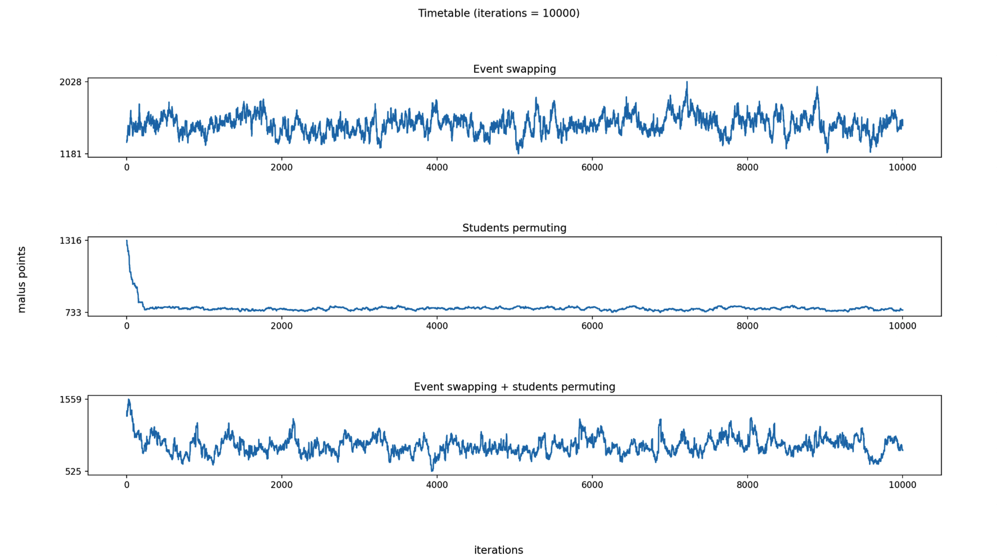

# 4. Hill climber

In deze fase heb ik een hill climber geïmplementeerd die alleen maar even goede
of betere oplossingen accepteert. Dit algoritme gaat door tot dat het aantal
opgegeven iteraties bereikt is, of als er na 200 iteraties geen strict betere
oplossing is gevonden.

:exclamation: Het moet hier *strict* beter zijn omdat het anders in een oneindige loop
terecht komt waarbij het even goede states kan krijgen, maar nooit een betere.

In de baseline fase heb ik een random walk gemaakt die aantoont hoe de malus
score wordt beïnvloedt door het omwisselen van twee random activiteiten of door
het verwisselen van studenten binnen een vak.

Hieronder nog een keer de grafiek van de random walk als opfrisser:

Zoals te zien is heeft het verwisselen wel wat effect, maar niet veel. Het
omwisselen van twee activiteiten heeft meer nut naar mate het aantal iteraties
groter wordt. Ik heb dus bedacht om in de hill climber het volgende te doen:
- 40% kans om een activiteit naar een random ander tijdslot te doen (in mogelijk een andere zaal)
- 50% kans om twee activiteiten om te wisselen
- 10% kans om studenten te verwisselen

Bij hill climber beginnen we met "een oplossing". Ik heb zowel de randomizer als
het greedy algoritme gebruikt algoritme voor mijn initiële oplossing. Omdat mijn
greedy een betere oplossing geeft (met minder aantal maluspunten) heb ik ervoor
gekozen om de hill climber toe te passen op een greedy oplossing om zo een nóg
betere oplossing te genereren.

Hieronder is te zien hoe de hill climber te werk gaat met zowel de randomizer
als het greedy algoritme. Naar mate het aantal iteraties toe neemt, wordt de som
van violations en maluspunten minder en minder voor beide versies.

Over het algemeen gaat het met greedy beetje bij beetje naar beneden, omdat het
altijd bij 120 maluspunten begint. Met de randomizer kan dit ook het geval zijn,
maar als het begint met een hoog aantal maluspunten, dan zal het erg snel dalen.
