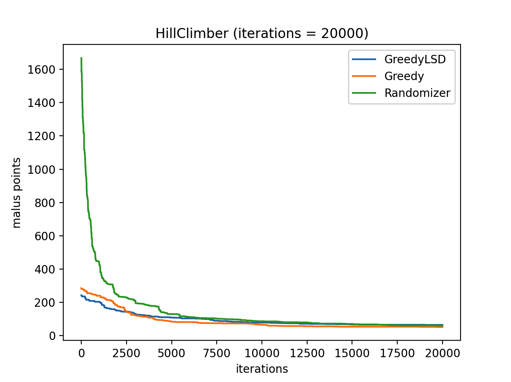

# 4. Hill climber

In deze fase heb ik een hill climber geïmplementeerd die alleen maar even goede
of betere oplossingen accepteert. Dit algoritme gaat door tot dat het aantal
opgegeven iteraties bereikt is, of als er na 500 iteraties geen strict betere
oplossing is gevonden.

:exclamation: Het moet hier *strict* beter zijn omdat het anders in een
oneindige loop terecht komt waarbij het even goede states kan krijgen, maar
nooit een betere.

In de baseline fase heb ik een random walk gemaakt die aantoont hoe de malus
score wordt beïnvloedt door het omwisselen van twee random activiteiten of door
het verwisselen van studenten binnen een vak.

Hieronder nog een keer de grafiek van de random walk als opfrisser:

Zoals te zien is heeft het verwisselen wel wat effect, maar niet veel na een
bepaald aantal iteraties. Het omwisselen van twee activiteiten geeft meer
speling in de grafiek, wat dus betekent dat dit veel invloed heeft. Ik heb dus
bedacht om in de hill climber het volgende te doen:
- 30% kans om een event in een tijdslot met een hoge malus score te verplaatsen
- 30% kans om een random activiteit naar een random ander tijdslot te doen
- 30% kans om twee activiteiten om te wisselen
- 10% kans om studenten te verwisselen

Bij hill climber beginnen we met "een oplossing". Ik heb de hill climber getest
op een oplossing van de randomizer en greedy om zo het effect te kunnen zien
voor een oplossing met een hele hoge malus score (randomizer) of een oplossing
die redelijk laag begint, zoals de greedy algoritmen.

Hieronder is te zien hoe de hill climber te werk gaat voor alle algoritmen. Naar
mate het aantal iteraties toe neemt, wordt de som van violations en maluspunten
minder en minder bij elk algoritme.

| algoritme  | start maluspunten | eind maluspunten |
| ---------- | ----------------- | ---------------- |
| Randomizer | 1668              | 61               |
| Greedy     | 286               | 52               |
| Greedy LSD | 243               | 62               |

Uit bovenstaande resultaat kunnen we concluderen dat de hill climber altijd
convergeert bij deze casus en aldus erg effectief is in het minimaliseren van de
maluspunten, ongeacht hoe hoog het begint

---

:point_right: [Klik hier om naar de volgende fase te gaan](../5-greedy-lsd/README.md)
