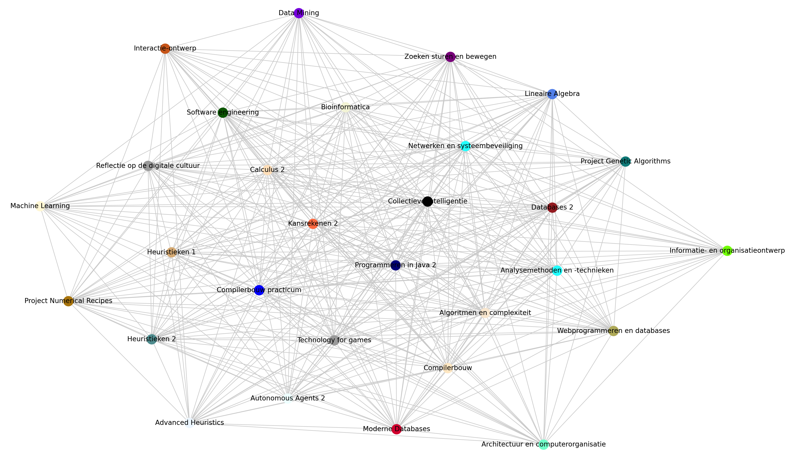

# 5. Greedy - Least Saturation Degree

Na de hill climber ben ik begonnen met nog een greedy variant die gebruik maakt
van een *Least Saturation Degree* waarbij het algoritme niet simpelweg de eerst
volgende node pakt in de lijst van activiteiten die ingepland moet worden, maar
diegene pakt met de meeste vak conflicten in het tot nu toe ingeroosterde
rooster. Met andere woorden, de activiteiten die het meeste conflict hebben die
worden als eerste ingeroosterd, omdat deze een minder aantal tijdsloten ter
beschikking heeft.

De saturation degree wordt als volgt berekent: gegeven een activiteit die nog
niet ingepland is, kijk in elk tijdslot waar activiteiten staan ingepland en
kijk of deze activiteiten een conflict hebben met deze activiteit. De saturation
degree krijgt +1 punt voor elk vak in het tijdslot dat een conflict geeft.

Maar hoe weten we of een vak een conflict heeft met een ander vak? We hebben
gelukkig al de data welke studenten welke vakken gaan volgen, we hoeven dit
alleen nog maar met elkaar te linken. Om dit te doen kunnen we gebruik maken van
*graph coloring* waarbij we een graaf (Engels: graph) hebben met de volgende
elementen:

- node: representeert een vak
- edge: minimaal één student volgt deze twee vakken

**Voorbeeld:** stel we hebben node A en node B, als er een edge aanwezig is
zodanig dat het node A met node B met elkaar verbindt, dan is er minimaal één
student die beide vakken volgt.

Met andere woorden, als we weten dat er minimaal één student is die vak A en vak
B volgt, dan weten we dus welke vakken we niet samen moeten inplannen.

---

Hieronder het stukje code dat de `networkx` package gebruikt om de graaf te
construeren en zo de vak conflicten te genereren.

```python
class Timetable:

    def __init__(self) -> None:
        self.timetable: TimetableList = self.new_timetable()
        self.courses = load_courses()
        self.students = load_students()

        self.set_course_conflicts()

    def set_course_conflicts(self) -> None:
        """
        Create a graph where each vertice represents a course and the edge in
        between two vertices indicates that there is at least one student
        enrolled in both courses, meaning that all neighbors for a node in the
        graph represent the conflicting courses for a course respectively.
        """
        # Create the graph.
        network = nx.Graph()
        network.add_nodes_from([course.name for course in self.courses])

        # Get all courses that are overlapping for each student.
        list_of_overlaps = [student.enrolled_courses for student in self.students]

        # Create each possible combination per overlap and add it as an edge.
        for courses in list_of_overlaps:
            for pair in itertools.combinations(courses, 2):
                network.add_edge(pair[0], pair[1])

        # Gather the data that was generated inside the graph.
        course_conflicts = {}
        for course_name in list(network.nodes):
            course_conflicts[course_name] = list(network[course_name].keys())

        # Assign the corresponding conflicting courses to each course.
        for course in self.courses:
            course.set_conflicting_courses(course_conflicts[course.name])
```

---

Vervolgens kunnen we ook `networkx` gebruiken om een visueel beeld te geven.

:bulb: onderstaande visualisatie kan gegenereerd worden met
`./main.py --visualization course-conflicts`



# Resultaat

In een latere versie heb ik extra maluspunten toegekend aan elk tijdslot voor
het aantal dubbel ingeplande activiteiten van hetzelfde vak. Bijvoorbeeld, als
er in een tijdslot 3 activiteiten zitten van hetzelfde vak, dan zijn er 2 te
veel hier, dus hier wordt een malus score van 2 extra toegekend. Dit resulteerde
in een verhoging (zoals verwacht) in het totaal aantal maluspunten voor het
rooster. Greedy heeft hiermee 286 maluspunten. Vervolgens heeft het Greedy LSD
algoritme 243 maluspunten behaald, aldus 43 punten minder. Hierbij heeft greedy
209 student conflicten en de Greedy LSD 176, een verschil van 33 student
conflicten.

Per iteratie van het greedy algoritme is een `get_next_event()` methode die
bepaald welke eerst volgende activiteit als eerste moet worden ingeplant. De
volgende logica resulteert in een lager resultaat dan het greedy algortime zelf:
- groepeer alle activiteiten die nog niet zijn ingepland de saturation degree
- pak alle activiteiten met de hoogste saturation degree
- sorteer al deze activiteiten oplopend op het totaal aantal activiteiten dat
  moet worden ingepland voor het bijbehorende vak (bijv: 1x hoorcollege + 3x
  werkcollege + 2x practicum = 6)
- de eerste activiteit in deze lijst wordt ingeplant.

---

:point_right: [Klik hier om naar de volgende fase te gaan](../6-tabu-search/README.md)
