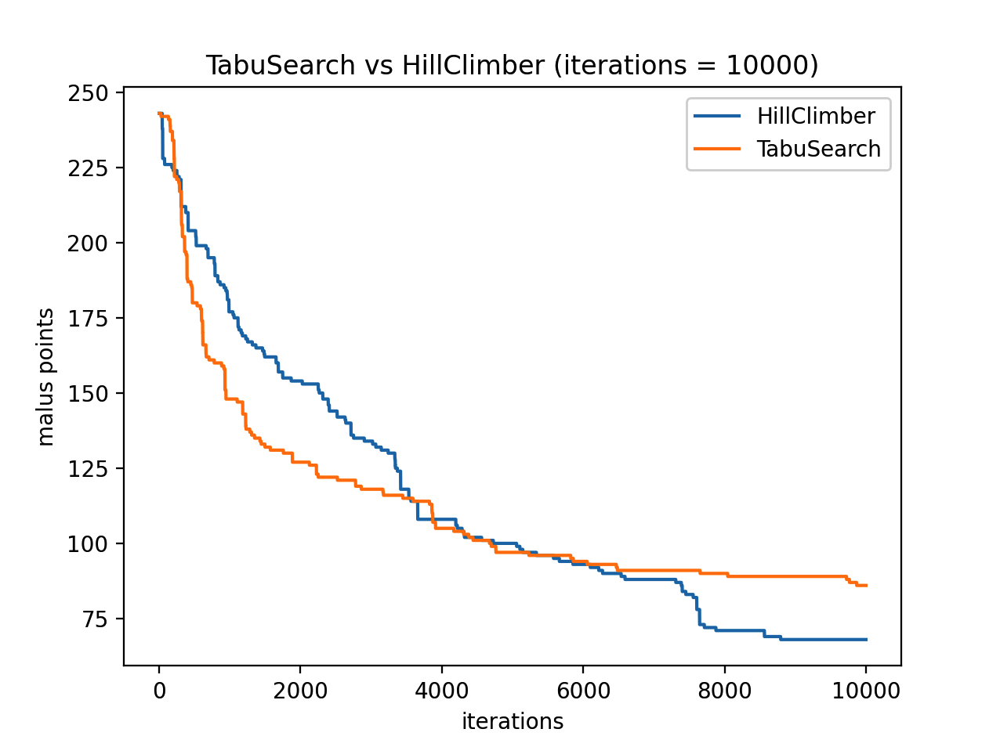
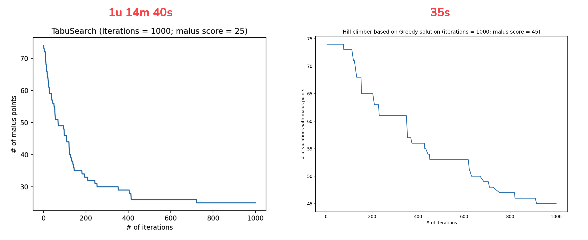
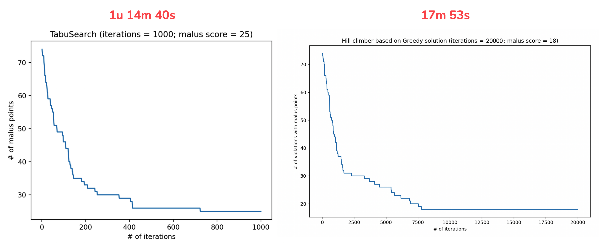

# 6. Tabu Search

Na het implementeren van de Greedy LSD heb ik de tabu search geïmplementeerd
naar aanleiding van meerdere wetenschappelijke artikelen die hebben aangetoond
dat Tabu Search goed werkt bij het inplannen van roosters, vooral bij het
inplannen van examens.

Ik ben begonnen met een eerste versie op basis van de
[pseudocode](https://en.wikipedia.org/wiki/Tabu_search#Pseudocode) op wikipedia.
Bij tabu search hebben we ook een *aspiration criteria*. Dit maakt het dat we
uit een local optimum kunnen komen. Één van de mogelijke aspiration criteria die
ik heb geïmplementeerd is door te kijken of een oplossing in de tabu list beter
is dan de tot nu toe best gevonden oplossing.

Bij tabu search wordt er voor elke iteratie een n-aantal neighbors gegenereerd
waarbij elke neighbor een kleine aanpassen heeft op basis van de beste mogelijke
oplossing. Elke neighbor moet een valide oplossing zijn, oftewel 0 violations en
dat maakt het dat het slomer wordt naar mate de maluspunten kleiner wordt. Het
zal een oplossing genereren totdat er n-aantal oplossingen zijn. Als er 10
moeten worden gegenereerd en de eerste 5 zijn geen oplossing, dan worden deze
opnieuw gegenereerd totdat er 10 valide oplossingen zijn.

# Tabu Search vs Hill Climber

Tot mijn verbazing doet de Hill Climber het over het algemeen veel beter dan de
tabu search. Zowel in snelheid als in aantal maluspunten.

Hieronder is te zien dat 1000 iteraties 1u 14m en 40s heeft geduurd voor de tabu
search, terwijl het maar 35s was voor de hill climber.

Maar! wat tabu search doet is 20 oplossingen per iteratie genereren, dus na 1000
iteraties heeft het 20K oplossingen gegenereerd. Bij de hill climber staan 1000
iteraties gelijk aan 1000 oplossingen, dus eigenlijk moeten we 1000 tabu search
iteraties vergelijken met 20K iteraties van de hill climber. Als we dat doen dan
is hill climber alsnog 57m eerder klaar dan de tabu search waarbij hill climber
zelfs een lagere malus score heeft weten te vinden.

